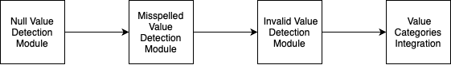

# Data Quality Assessment 
[report](./Final_report_Data_Quality_Assessment.pdf)
## Project Description
Open data often has quality issues. These can negatively impact the results of analyses or data-driven models based on the data.  

In this project, our goal is to identify quality issues in datasets from [NYC Open Data](https://opendata.cityofnewyork.us). In particular, we develop methods to automatically identify suspicious/anomalous values in tables.  These values may be explicit null values (e.g., N/A), disguised null values (e.g., 999-999-9999 in a phone number column), syntactic outliers (e.g., alpha-numeric strings in a column consisting of alphabetic last names), semantic outliers (e.g., a state name in a column of city names), misspellings (e.g., brokklyn vs brooklyn), etc. One important question to explore is: can we define quality measures for datasets to help users make more informed decisions when they are selecting datasets?

## Purpose
develop (semi-)automated techniques that classify column values into one of the following four categories:
1) Valid value
2) Misspelling/Abbreviation of a valid value
3) Invalid value
4) NULL value
For values in class 2 list the valid value. For invalid values, flag them as semantic outliers (e.g., values that are valid in a different column/domain) if appropriate.

NULL values can be represented in many different ways (e.g., NULL, n/a, 999, 999-999-9999) and there are different types of outliers, therefore, manual inspection will be required to obtain this information. You can use existing profiling tools to help you better understand the data, e.g., the Datamart profiler (https://docs.auctus.vida-nyu.org/python/datamart-profiler.html) and data-profile-viewer, both available as Python packages:
https://pypi.org/project/datamart-profiler
https://github.com/soniacq/DataProfileVis

You should also try to answer the following questions:
+ Are there patterns for how NULL values/outliers are represented?
+ What is the precision and recall of the techniques you designed/implemented?
+ When and why does your approach fail?

## Architecture

## Method
+ NULL Value
  1. Explicit Null
   
      - Pandas `isNull()`

      - Regular expression matching
  2. Disguised MAR/MCAR(Missing At Random/Missing Completely At Random) values 
   
      - FAHES(Qahtan et al., 2018)

      - MCAR: The missingness of data is entirely unrelated to any data.

      - MAR: The missingness of data is related to some of the observed data but not to the missing data itself.
  
  3. Repetitive pattern
   
      - Modified source code of FAHES(Qahtan et al., 2018) 
      - Standard deviation of character difference 

+ Misspell & Abbreviation
  - `SpellChecker` in Python Library
  - GloVe(Global Vectors for Word Representation): a method based on semantic similarity.

+ Invalid
  1. Type Invalid
      - Numeric data: check character and range
      - Date format: regular expression
  2. Semantic Invalid
      - Invalid country: pycountry (a python library)
  3. Outliers
   
      Algorithms: 

      KNN(using largest, mean, median distance respectively), Isolation Forest, ABOD, HBOS, ECOD, Feature Bagging. 

## Team

## Result Output
[output](./output/)

## References & Resource
+ [Efficient Algorithms for Mining Outliers from Large Data Sets. Ramaswamy et al., SIGMOD 2000.](https://dl.acm.org/doi/abs/10.1145/342009.335437) 
+ [Cleaning disguised missing data: a heuristic approach. Ming Hua, Jian Pei. KDD 2007: 950-958](https://web.archive.org/web/20070824063404id_/http:/www.cs.sfu.ca/~jpei/publications/dmv-kdd07.pdf)
+ pyOD
  + [github](https://github.com/yzhao062/pyod)
  + [doc](https://pyod.readthedocs.io/en/latest/)
+ [FAHES](https://github.com/daqcri/FAHES_Code)

